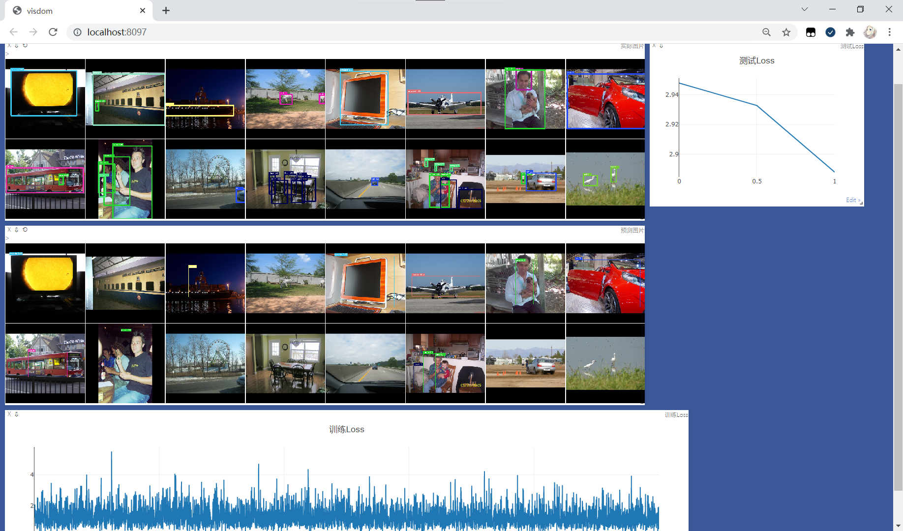

# yolo-v1-demo

基于Pytorch实现的Yolo V1

使用ResNet34简化模型结构，并引入Dropout层减少过拟合。

## 如何使用

### 准备

准备数据集，此处以VOC 2012为例，解压并放入data目录中

```
D:\CODE\YOLO-V1-DEMO\DATA
└─VOC2012
    ├─Annotations
    ├─ImageSets
    │  ├─Action
    │  ├─Layout
    │  ├─Main
    │  └─Segmentation
    ├─JPEGImages
    ├─SegmentationClass
    └─SegmentationObject
```

运行`preprocessing.py`

```shell
python preprocessing.py
```

运行后将在同级目录下生成img, label两个目录，并有train.txt, test.txt两个文件

```
D:\CODE\YOLO-V1-DEMO\DATA
├─img
├─label
└─VOC2012
    ├─Annotations
    ├─ImageSets
    │  ├─Action
    │  ├─Layout
    │  ├─Main
    │  └─Segmentation
    ├─JPEGImages
    ├─SegmentationClass
    └─SegmentationObject
```

### 安装与运行

安装依赖

```shell
pip install -r requirements.txt
```

设置参数，见主程序开头

```python
# 初始化参数
# EPOCHS: 总的训练次数
# HISTORICAL_EPOCHS: 历史训练次数，用于模型的加载
# - -1表示最近一次训练的模型
# - 0表示不加载历史模型
# - >0表示对应训练次数的模型
# SAVE_EVERY: 保存频率，每训练多少次保存一次
# BATCH_SIZE: 每次喂入的数据量
# LR: 学习率
EPOCHS = 50
HISTORICAL_EPOCHS = -1
SAVE_EVERY = 5
BATCH_SIZE = 4
LR = 1e-4
```

除此之外，其他文件开头也有自定义参数，可根据需要自行调整。

启动Visdom

```shell
python -m visdom.server
```

运行主程序

```shell
python main.py
```

### 可视化展示

进入[http://localhost:8097](http://localhost:8097)查看可视化训练过程



### 测试

运行`show_yolo.py`展示Yolo的训练效果，默认使用最后一次训练的模型，并展示数据集从下标0开始的10张图片，可根据需要自行调整

生成的效果图片默认位于`output/img`目录下，其中前缀为pred、target的图片分别表示预测图片和真实图片，下标一一对应

```shell
python show_yolo.py
```

## 介绍

### 目录结构

- `dataset.py`：数据集
- `main.py`： 主程序
- `preprocessing.py`：预处理
- `show_yolo.py`：训练结果展示
- `util.py`：工具类
- `yolo_v1_loss_vectorization.py`：矢量化的Yolo V1 loss计算
- `yolo_v1_loss.py`：非矢量化的loss计算
- `yolo_v1.py`：Yolo V1主模型，采用ResNet34代替支撑结构
- `show_camera.py`: 调用摄像头实时进行检测